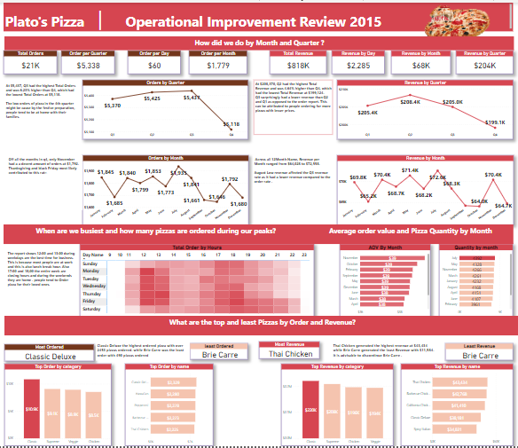
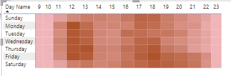
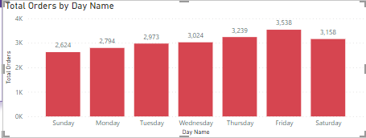
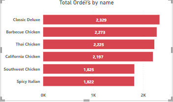
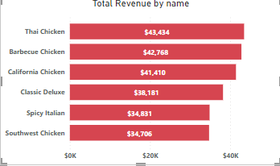
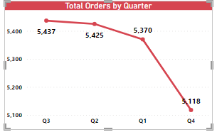
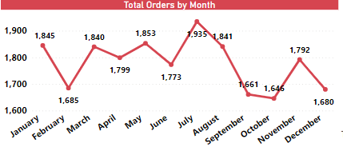

# Pizza-Dashborad

## Business Problem

This week I worked on a pizza company's dataset. Plato's Pizza place is located in New Jersey . The founder collected a year's worth of transactional data with the hopes to improve the business more efficiently.

## The founder wants to find out :
* The busiest days and times 
* The best and worst selling pizzas, how much they generated and total orders
* How the business did , the total revenue and orders per month and Quarter 
* If there are any pizza, they should take off the menu or any promotions they could leverage .
The dataset contains 4 tables:
Orders - Contains the transaction info (id, date, time)
Order Details - Contains details of the order
Pizzas - Contains info on each type of pizza's size and price
Pizza types - Contains info about each pizza type like name and ingredients
## Check out the full dataset here!

## PowerBi Dashboard

## Analysis
### What days and times are our busiest?

The busiest day of the week is Friday with 3538 total orders and with $136,074 total revenue, an average of 71 orders every Friday. 
Busiest times are 12:00 pm - 13:00 pm and 17:00 pm - 18:00pm.

## The best and worst selling pizzas, how much they generated and total orders.

The best performing Pizza by order is classic Deluxe, had exactly 2,329 orders , however, generated $38,181, while Thai chicken pizza is the best selling generated the most revenue with $43,434 and had 2,225 orders.
* The under performing pizza by orders and revenue is Brie Carre. It generated $11,589 and had exactly 480 orders the entire year 

## How the business did , the total revenue and orders per month and Quarter 

Plato's Pizza Place made $818,860 and had 21,350 pizzas ordered.

## Recommendations
After Analyzing the data, I was able to gain valuable insights, they can improve the business.
I would recommend the following suggestions to the owners.
* The owner should run a discount on Brie Carre, which is the under-performing pizza, during peak hours especially on Fridays from 12:00 pm - 13:00 pm and 17:00 pm - 18:00 pm. If this doesn't improve its performance , it is advisable it should be d discontinued, as it is not generating enough revenue.
* It advisable to reduce the working hours to 11am - 10pm. This would help reduce operating cost and also increase profits.
